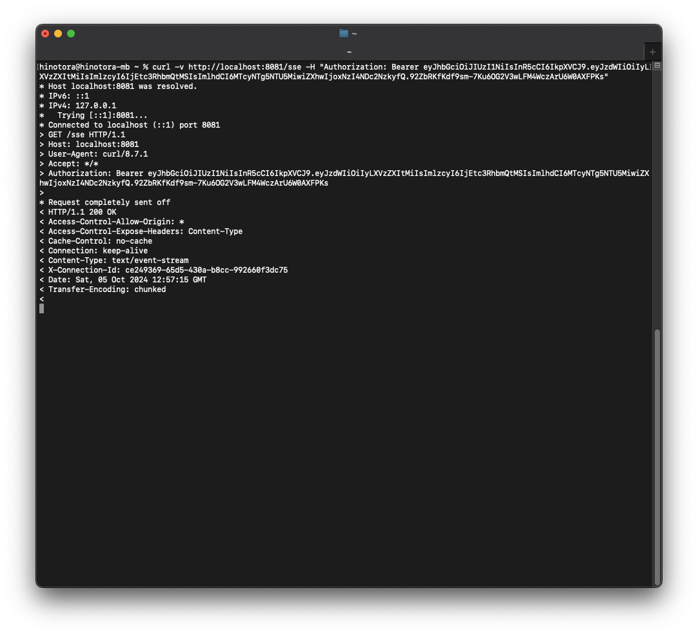
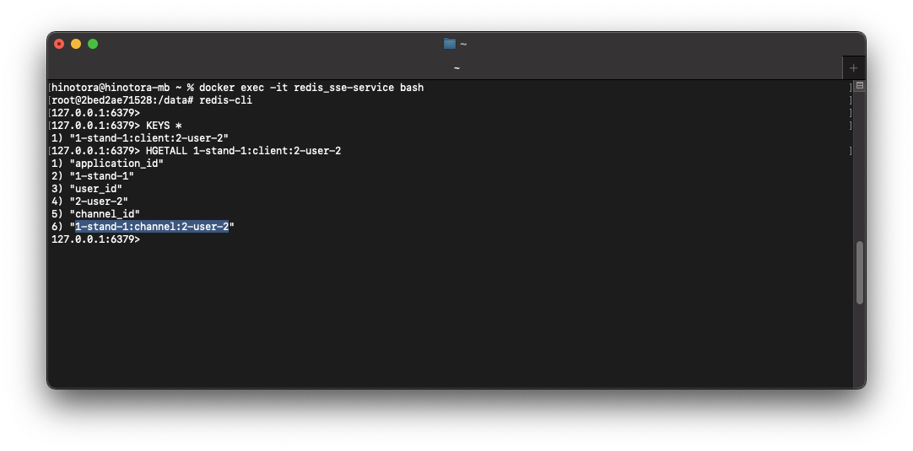
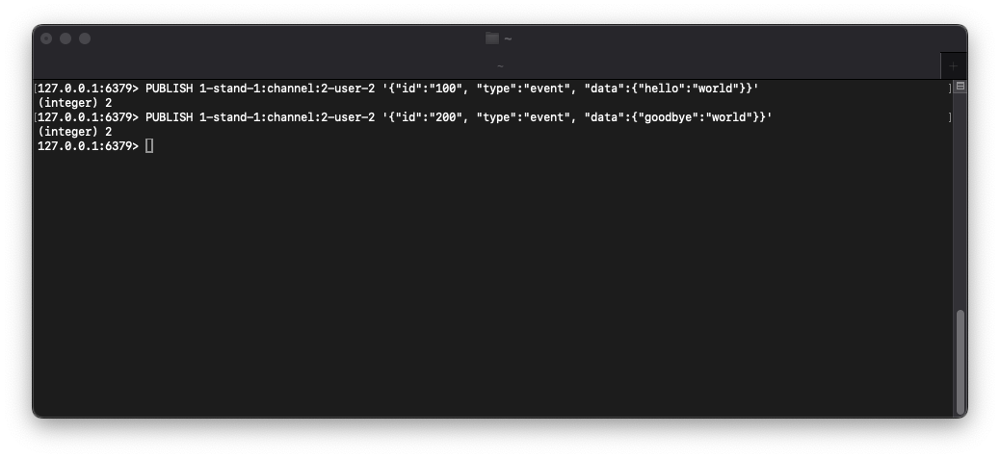
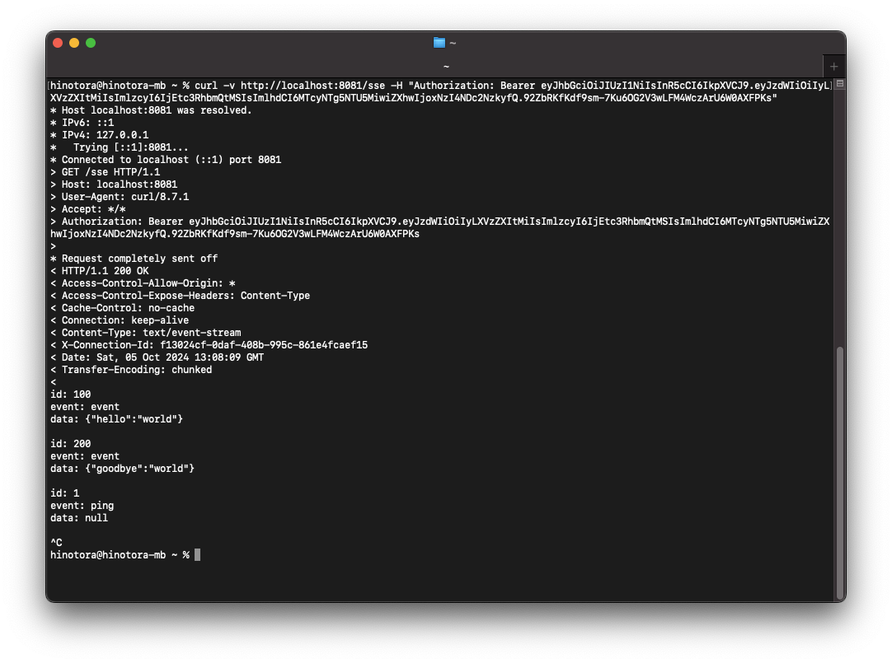
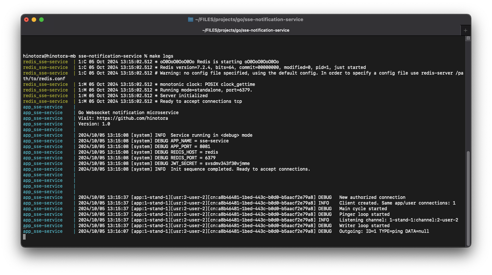

# SSE Notification service

Socket service using SSE to deliver some kinds of events

## What is SSE?

Server-Sent Events (SSE) is networking technology that allows servers to push real-time client updates over a single HTTP connection


There are a lot of examples and information about, for example [MDN](https://developer.mozilla.org/en-US/docs/Web/API/Server-sent_events/Using_server-sent_events).


## What is this microservice about?

This service is a standalone docker-compose application which allows you to add SSE functionality to your project. For example you want to addsome king of notifications into yout website or use browser push notifications. This micrioservice might help you.

## Installing

### Requirements

- git
- docker 
- ~600MB of free space (for docker images)

This service by default uses its own `Redis` if you dont want it just edit docker compose file and edit .env file

### Cloning, configuring and building

```bash
    # clone code into your working folder
    $ git clone https://github.com/hinotora/sse-notification-service.git

    # cd into it
    $ cd sse-notification-service

    # copy environment file
    $ cp .env.example .env
```

Next you need to configure environment variables (open .env file with any editor)

```bash
    # Application name, used to give names to docker containers to avoid collisions, may be whatever you want
    APP_NAME=sse-service 

    # External port, application will listen connections on this port
    APP_PORT=8080

    # App mode, allows you to get more debug data in logs, for silent use `production`
    APP_MODE=debug

    # Redis host and port, used to connect to redis bus
    REDIS_HOST=redis
    REDIS_PORT=6379

    # Secret key to verify JWT signatures, must be same here and on the issuser service (for example auth service)
    JWT_SECRET=my-secret-key
```

And finally build image

```bash
    # build docker images
    $ make build
```

After successfull build you can run application

```bash
    make up
```

## Usage

### Routes

Postman collection is [there](docs/examples/sse_notification_service.postman_collection.json)

```bash
    # =======================================================================
    # Health endpoint
    GET /health


    200 OK
    Content-Type: application/json

    {
        "status": "ok"
    }

    # =======================================================================
    # Main SSE socket. Used to connect via SSE
    GET /sse
    Authorization: Bearer jwt


    200 OK
    Content-Type: text/event-stream
    X-Connection-Id: be91753e-0200-4c6d-8805-f98ee6760667

    ... sse data here

    # =======================================================================
    # Get all connections assosicated with one application (iss)
    GET /connections/{application_id}
    Authorization: Bearer jwt


    200 OK
    Content-Type: application/json

    {
        "user-id-1": {
            "connection-id-1": {
                "id": "connection-id-1",
                "created_at": 1728135324,
                "remote_addr": "",
                "application": {
                    "id": "app-id-1"
                },
                "user": {
                    "id": "user-id-1"
                }
            },
        },
        "user-id-2": {
            "connection-id-1": {
                "id": "connection-id-1",
                "created_at": 17281324234,
                "remote_addr": "",
                "application": {
                    "id": "app-id-1"
                },
                "user": {
                    "id": "user-id-2"
                }
            },
        }
    }

    # =======================================================================
    # Get all connection assosicated with one application (iss) and user (sub)
    GET /connections/{application_id}/{user_id}
    Authorization: Bearer jwt


    200 OK
    Content-Type: application/json
    {
        "connection-id-1": {
            "id": "connection-id-1",
            "created_at": 1728132343,
            "remote_addr": "",
            "application": {
                "id": "app-id-1"
            },
            "user": {
                "id": "user-id-1"
            }
        },
        "connection-id-2": {
            "id": "connection-id-2",
            "created_at": 1728132342,
            "remote_addr": "",
            "application": {
                "id": "app-id-1"
            },
            "user": {
                "id": "user-id-1"
            }
        }
    }
```

### Authorization

Service uses JWT (HS256) auth on protected routes. Payload must be:

```json
{
  "sub": "user-id-1",
  "iss": "app-id-1",
  "iat": 1725895592,
  "exp": 1728476792
}

```

### Data transfer

#### 1. Start to listen SSE connection 



As you can see curl waits for incoming data and NOT closes conenction.

#### 2. Explore and find active SSE connections via redis

After successfull SSE connection service creates redis hash set which contains data about connection. After SSE disconnect key will be deleted. Lets explore data:



#### 3. Send message into channel



#### 4. Receive data from client side



Service also sends ping events every 30 seconds. This can be used as client-side service healthcheck.

## Other actions

```bash
    # Restart service
    make restart 

    # Stop service
    make down

    # Read and follow service logs (Ctrl + C to exit)
    make logs
```

### Logs example:




## License

There is no license. But please create link to this repo, i would appreciate this :)